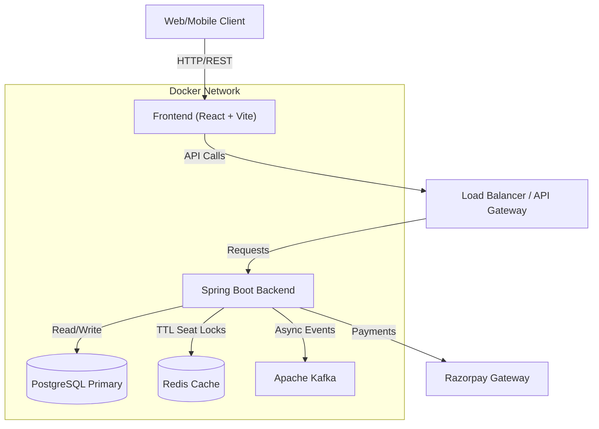

# 🌊 TicketWave
> **Enterprise-Grade Event Booking & Ticketing Platform**


TicketWave is a high-concurrency, full-stack ticketing platform designed to handle real-time seat booking, payments, and event management. It leverages a modern microservices-ready architecture with **Spring Boot**, **React**, **Redis** for distributed locking, **Kafka** for asynchronous messaging, and **PostgreSQL** for transactional integrity.

---

## 🏗️ System Architecture

The application is containerized using **Docker** for a seamless "write once, run anywhere" experience, supporting both local development and LAN access (Mobile + Desktop).



---

## 🚀 Key Features

### 🎟️ **Booking Engine**
* **Real-Time Concurrency Control:** Prevents double-booking using **Optimistic Locking** (`@Version`) and **Redis Distributed Locks** (TTL-based seat reservation).
* **Visual Seat Selection:** Interactive React-based seat map with real-time availability status.
* **Dynamic Pricing:** Support for different seat tiers (VIP, Standard, Economy).

### 🔐 **Security & Identity**
* **Stateless Authentication:** Secure **JWT (JSON Web Token)** implementation with custom filters.
* **Role-Based Access Control (RBAC):** Distinct flows for `ROLE_USER` and `ROLE_ADMIN`.
* **Password Security:** BCrypt hashing for credential storage.

### 💳 **Payments & Checkout**
* **Razorpay Integration:** Seamless payment gateway integration for credit/debit/UPI transactions.
* **Transactional Integrity:** ACID-compliant booking workflows ensuring data consistency.
* **Webhook Support:** Handles asynchronous payment success/failure callbacks.

### ⚙️ **DevOps & Infrastructure**
* **Dockerized Environment:** Full stack (DB, Broker, Backend, Frontend) spins up with a single command.
* **Database Migrations:** Automated schema evolution using **Flyway**.
* **Universal Access:** Configured for cross-device testing (access via Local IP on Mobile).

---

## 🛠️ Technology Stack

| Category | Technology | Usage |
| :--- | :--- | :--- |
| **Backend** | Java 21, Spring Boot 3 | Core Business Logic, REST APIs |
| **Frontend** | React, TypeScript, Vite | UI/UX, State Management |
| **Database** | PostgreSQL | Relational Data Persistence |
| **Cache** | Redis | Temporary Seat Locking, Session Data |
| **Messaging** | Apache Kafka | Async Notifications, Event Streaming |
| **Security** | Spring Security, JWT | AuthN & AuthZ |
| **DevOps** | Docker, Docker Compose | Container Orchestration |
| **Build Tools** | Maven, npm | Dependency Management |

---

## ⚡ Getting Started

### Prerequisites
* **Docker Desktop** (Running)
* **Java 21 JDK** (Optional, for local dev)
* **Node.js 18+** (Optional, for local dev)

### 🐳 Method 1: The "One-Click" Docker Setup (Recommended)
This method launches the Database, Kafka, Redis, Backend, and Frontend simultaneously.

1.  **Clone the Repository**
    ```bash
    git clone [https://github.com/rohith1921/ticketwave.git](https://github.com/rohith1921/ticketwave.git)
    cd ticketwave
    ```

2.  **Configure Environment Variables**
    Create a `.env` file in the root directory (see [Configuration](#-configuration) section below).

3.  **Build and Run**
    ```bash
    docker-compose up --build
    ```

4.  **Access the App**
    * **Frontend:** `http://localhost:5173` (or `http://YOUR_IP:5173` for mobile)
    * **Backend API:** `http://localhost:8080/api`
    * **Database:** Port `5432`

### 🔧 Method 2: Manual Setup (Local Development)

<details>
<summary>Click to expand manual setup instructions</summary>

**1. Infrastructure (DB, Redis, Kafka)**
```bash
docker-compose up -d postgres redis kafka zookeeper
```

**2. Backend (Spring Boot)**
```bash
cd booking-service
./mvnw clean install
./mvnw spring-boot:run
```

**3. Frontend (React)**
```bash
cd ticket-booking-frontend
npm install
npm run dev
```
</details>

---

## 🔧 Configuration

Create a `.env` file in the project root. **Never commit this file to version control.**

```ini
# --- Application Config ---
APP_NAME=TicketWave
SPRING_PROFILES_ACTIVE=dev

# --- Database ---
POSTGRES_USER=postgres
POSTGRES_PASSWORD=postgres
POSTGRES_DB=ticketwave_db

# --- Security ---
# Generate a secure 256-bit secret key
JWT_SECRET=your_super_secret_jwt_signing_key_must_be_long
JWT_EXPIRATION=86400000

# --- Payments (Razorpay) ---
RAZORPAY_KEY_ID=rzp_test_xxxxxxxxx
RAZORPAY_KEY_SECRET=xxxxxxxxxxxxx

# --- Network (Optional) ---
# Your Local IP for Mobile Testing (e.g., 192.168.1.5)
MY_IP_ADDRESS=localhost 
```

---

## 📚 API Documentation

The backend exposes a RESTful API. Below are the primary endpoints:

| Method | Endpoint | Description | Auth Required |
| :--- | :--- | :--- | :--- |
| `POST` | `/api/auth/register` | Register a new user | ❌ |
| `POST` | `/api/auth/login` | Login and receive JWT | ❌ |
| `GET` | `/api/events` | List all available events | ❌ |
| `GET` | `/api/events/{id}/seats` | Get seat map & availability | ❌ |
| `POST` | `/api/booking/book` | Reserve seats (Redis Lock) | ✅ |
| `POST` | `/api/payments/create` | Initiate Razorpay Order | ✅ |

---

## 🐛 Troubleshooting

**1. "User Not Found" after Docker Restart**
* **Cause:** The database volume was wiped, but your browser has an old JWT token.
* **Fix:** Clear Local Storage in your browser (`F12` > Application > Local Storage > Clear) and log in again.

**2. Mobile Phone Cannot Connect**
* **Cause:** Frontend is trying to talk to `localhost` (which refers to the phone itself).
* **Fix:** Update `docker-compose.yml` `VITE_API_BASE_URL` to use your computer's LAN IP (e.g., `192.168.x.x`) and ensure Firewall allows port `8080` & `5173`.

**3. Database "Duplicate Key" Error**
* **Cause:** Manual SQL inserts conflicted with the auto-increment sequence.
* **Fix:** The migration script has been updated to sync sequences. Run `docker-compose down -v` to reset cleanly.

---

## 🤝 Contributing

Contributions are welcome! Please follow these steps:
1.  Fork the repository.
2.  Create a feature branch (`git checkout -b feature/AmazingFeature`).
3.  Commit your changes (`git commit -m 'Add some AmazingFeature'`).
4.  Push to the branch (`git push origin feature/AmazingFeature`).
5.  Open a Pull Request.

---

## 📄 License

Distributed under the MIT License. See `LICENSE` for more information.

---

<div align="center">
  <sub>Built with ❤️ by <b>Rohith</b> using Java, React, and Coffee.</sub>
</div>
